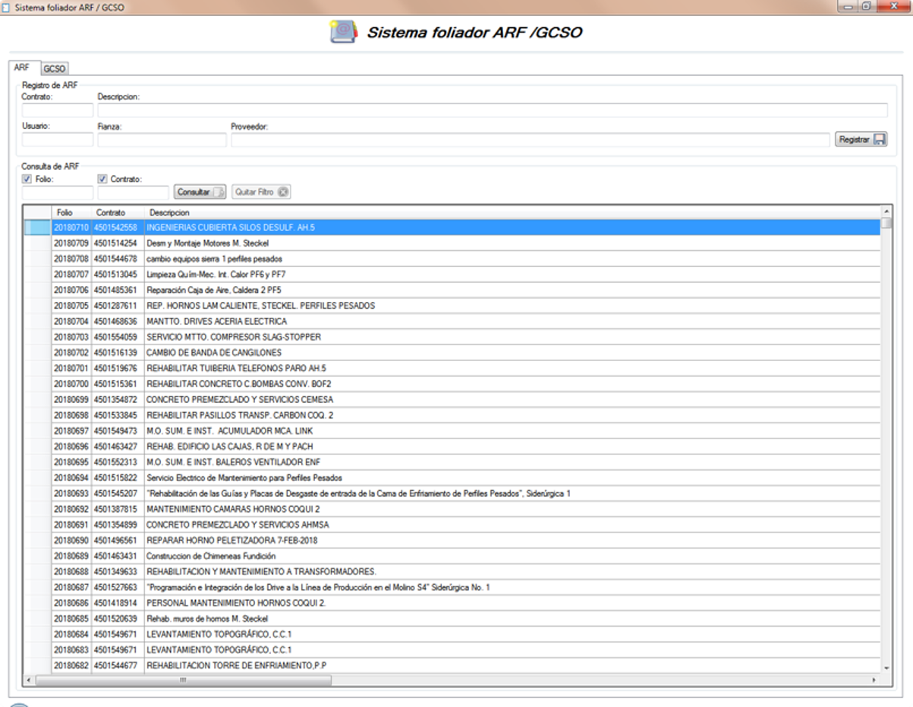

# 📦 SICAP Foliador

## 🧭 Overview
**SICAP Foliador** is a lightweight Windows application developed as a complement to the **[SICAP](https://github.com/HermiloOrtega/SICAP)**, designed specifically to manage the creation and tracking of administrative folios (IDs) associated with project contracts.

The system ensures all new documentation linked to contracts has a unique, standardized folio number, improving traceability, auditing, and administrative workflows.

### Home screen

---

## 💡 Idea & Concept
- Simplify the generation of folio IDs for administrative contract documents.
- Enable contract-related document tracking without overwhelming the main **[SICAP application](https://github.com/HermiloOrtega/SICAP)**.
- Centralize folio history and project associations for auditing and operational transparency.

---

## ✨ Features & Functionality
- **New Folio Registration**:
  - Automatically generate the next available folio ID.
  - Link folios to active projects and contracts.

- **Folio Tracking**:
  - Display recently generated folios and their associated contract/project metadata.

- **Simple Search Functionality**:
  - Quickly retrieve folios by project name, folio number, or **[SAP ERP](https://www.sap.com/canada/products/erp/what-is-sap-erp.html)** reference.

- **Error Prevention**:
  - Validation checks to avoid duplicate or skipped folio numbers.

- **User Restrictions**:
  - Only authorized administrative personnel permitted to create new folios.

---

## ⚙️ Tech Stack
| Category                | Tools & Frameworks |
|-------------------------|--------------------|
| **Frontend**            |  |
| **Backend**             |  |
| **Platform**            |  |
| **Framework**           |  |
| **IDE**                 |  |
| **Database**            |  |

---

## 🏗 Architecture & Design
- Lightweight, single-form design focused on usability and speed.
- Integration with **[SICAP](https://github.com/HermiloOrtega/SICAP)** Database's project and contract tables.
- Clean modular code to allow easy maintenance and enhancements.

---

## 🚀 Deployment & Hosting
- Installed on designated administrative machines.
- Connected securely to internal SQL Server environments.

---

## 🧑‍💻 My Role & Contributions
- Full design and development of the application.
- UI/UX creation focused on minimalism and efficiency.
- Integration with **[SICAP](https://github.com/HermiloOrtega/SICAP)** database's architecture.
- SQL query optimization for fast retrieval and secure folio creation.

---

## 🧗 Challenges & Learnings
- Designing a micro-application with reliability and very low error tolerance.
- Ensuring multi-user consistency without introducing concurrency errors.
- Embedding the solution into larger **[SICAP](https://github.com/HermiloOrtega/SICAP)** workflows without disruption.

---

## 📈 Future Enhancements
- Add export to Excel for folio history reporting.
- Integrate approval workflows for folio assignment.
- Implement user activity logging for auditing purposes.

---

## 🤝 Project Type
Internal Operational Enhancement — Part of the **AHMSA** Systems Ecosystem.

---

## 🪪 License
⚠️ Internal Confidential Project — Copyright reserved to **AHMSA**.
